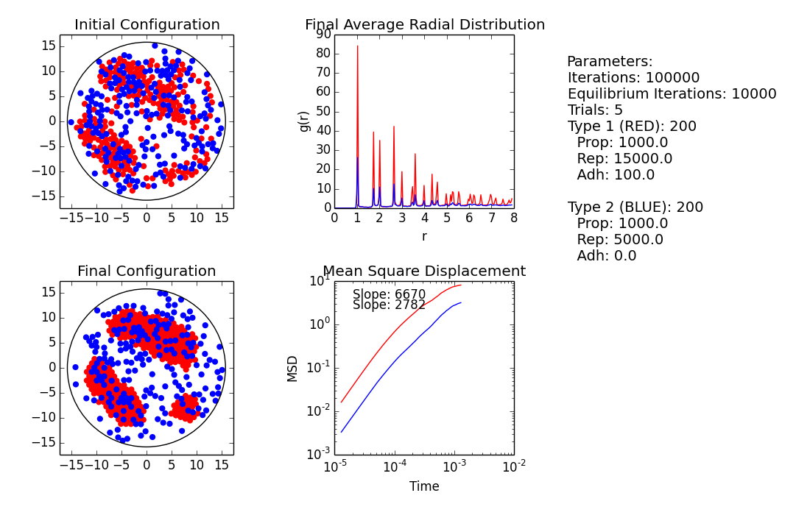
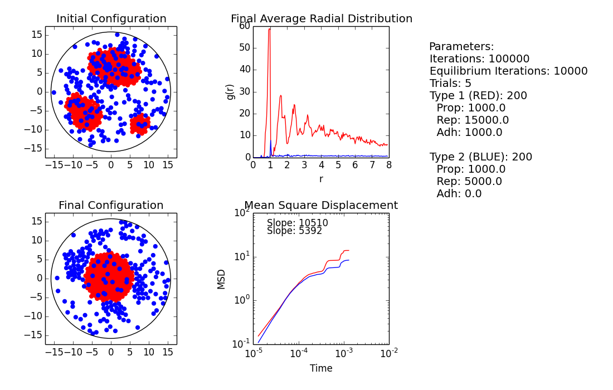
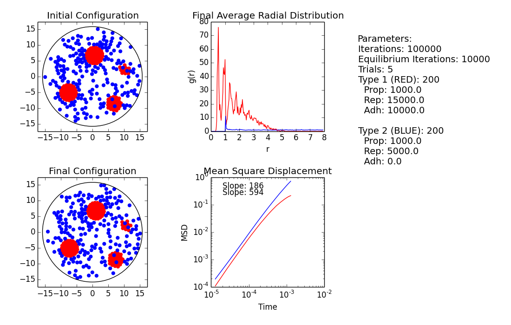

## Variable Adhesion

 - $10^9$ iterations
 - $10^4$ Equilibrium steps (recording started at 10^4)
 - $10^5$ Steps after equilibrium
 - 5 trials
 - Adhesion 1 Effective distance: 0.1 diameters

## Adhesion 1 = $10^2$

Adhesive type clumps. MSD slows as more order is introduced through clumping.

\pagebreak

## Adhesion 1 = $10^3$

Adhesive type separates. Some non adhesive get stuck in adhesive (adhesive force seems to be to great for repulsive/propulsive forces to escape). Non adhesive types show some clumping.
MSD reflects interaction between clusters of adhesive type. Seems to approach very small values after separation (investigate).

\pagebreak

## Adhesion 1 = $10^4$

Adhesive types separate into clusters. Falling MSD might indicate a stable system (adhesion too strong). Likly dependent on initial conditions and radius for adhesive interactions.

